# Gojo Persistent Mind 架构报告

> 只读审计。未改业务代码、未 commit、未 push、未连生产库。  
> 审计对象：`D:\GojoAssistant` 当前工作树，HEAD `32724ea`（`feat: add realistic reply availability and media event memory`）。  
> 接管来源：Codex 会话 `01a0aa73` 因额度中断，半成品在 `report_content.py`。该稿审计的是另一份 Codex 工作树（HEAD `90918e6`），**不能直接当作当前仓库现状**。

状态标记：

| 标记 | 含义 |
|---|---|
| ✅ | 已实现，且已接到真实聊天/启动路径 |
| ◐ | 已有结构或部分实现，目标语义未闭环 |
| ❌ | 当前代码中不存在 |
| ? | 仅凭本地源码无法确认（生产日志、部署开关、真实数据） |

运行事实的来源：源码已接通启动/聊天路径；此前你确认 relationship → cognitive event → trigger → queue → slow cycle 已实际跑过。本报告保留该事实，但**不把目标设计写成已经实现**。

---

## 0. 对 Codex 半成品的处置

保留其正确骨架：三条主线（记忆 / 关系 V4 / Fast-Slow 认知）、八条架构法则、Habit / Recollection / Commit Gate 的目标语义、以及“存储 ≠ 可访问记忆 ≠ 工作上下文”。

必须修正的过时结论（对照当前 `D:\GojoAssistant`）：

| Codex 当时判断 | 当前真实代码 |
|---|---|
| 未找到 `memory_lifecycle.py` | 文件存在，启动时建表，提取器已接入 |
| `cognitive_reader.py` 不存在，聊天不读认知对象 | 文件存在，经 `shared_relation_prompt` 注入聊天 prompt |
| Slow 合法根字段只有 summary / belief / hypothesis / prediction | 现已有 `question_updates`、`reflection_note`，可选 `sticky_note_updates`、`diary_entries` |
| Prediction resolver 是消息数 / 间隔秒 / evidence_count | 现仅允许 `current_event_signal_outcome` |
| `short_memory` 无 `source_event_id` | 已有该字段，以及部分唯一索引 |
| Sticky 只有 `char_grumble` | 用户可见便利贴只读 `cognitive_sticky_notes`（`source=cognitive_slow_loop`）；lifecycle sticky 仍是内部记忆提示；`grumble_engine` / `char_grumble` 已退役 |
| 无 candidate / episodic 层 | 有 `memory_lifecycle_items`，但是关键词启发式，不是海马体模型 |
| 认知生成接口完全未接通 | Reader 已接通；预测仍故意不注入聊天 |

下文是统一报告，不再分“Codex 前半 + Cursor 后半”。

---

## 1. Technical Architecture

### 1.1 总架构

当前真实结构是**回复后并行后台**，不是单一事务流水线。

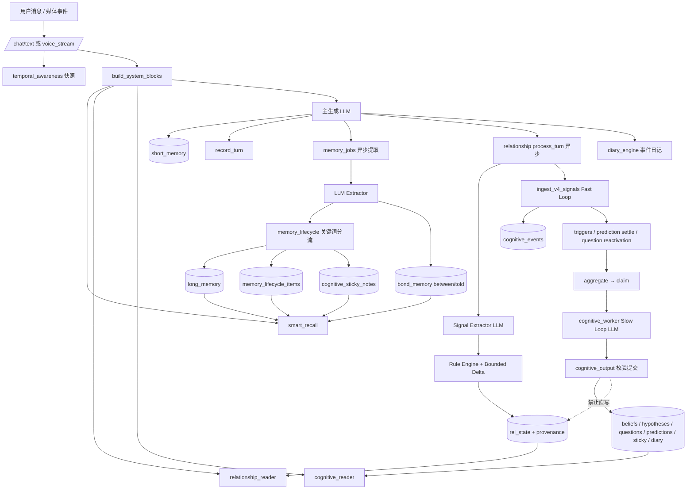

当前缺口一眼可见：提取、关系、事件日记、认知 Slow Loop **四条后台链并行**。心里话不再走独立 `grumble_engine`。它们共享的不是统一 Raw Event，而是同一轮对话文本。

### 1.2 Memory Architecture

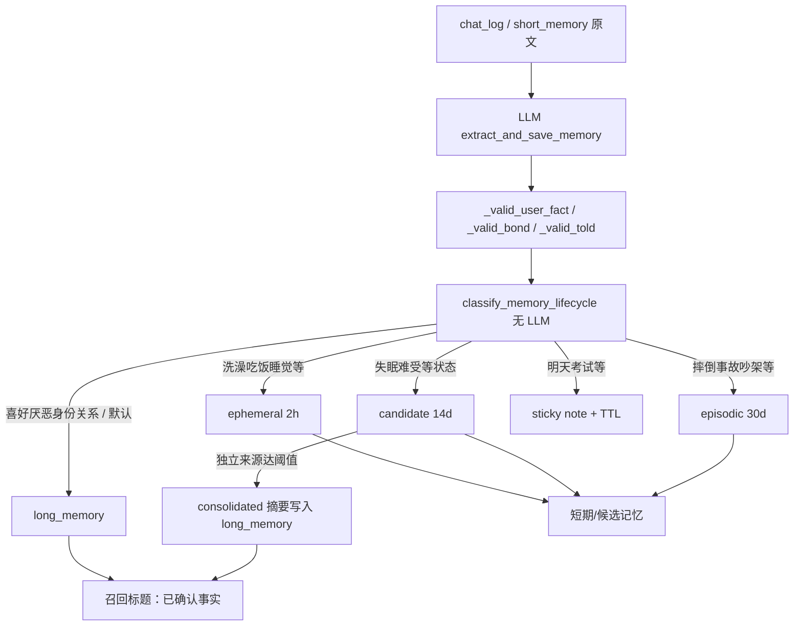

**当前不是目标海马体。** `memory_lifecycle` 做的是：阻止一部分日常流水账进入 `long_memory`，并把重复状态收成一句摘要。它没有：

- 独立日期去重后的 habit 时间窗
- support / exception / confidence
- “未观察 ≠ 未发生”
- FACT / INTERPRETATION / DEFER / REJECT 四出口

### 1.3 Memory Lifecycle（当前真实 + 目标）

当前 `memory_lifecycle_items.status`：

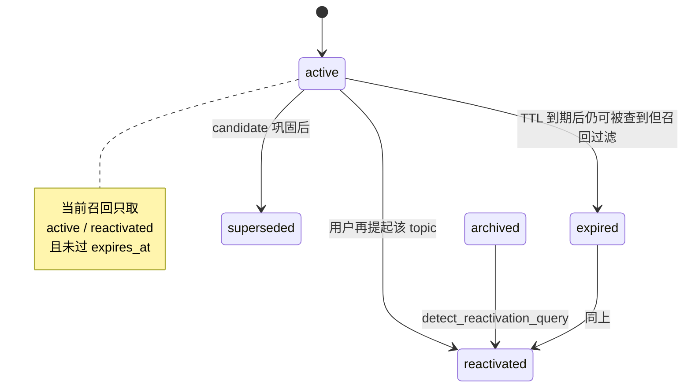

目标情景记忆（尚未作为独立海马体表实现）：

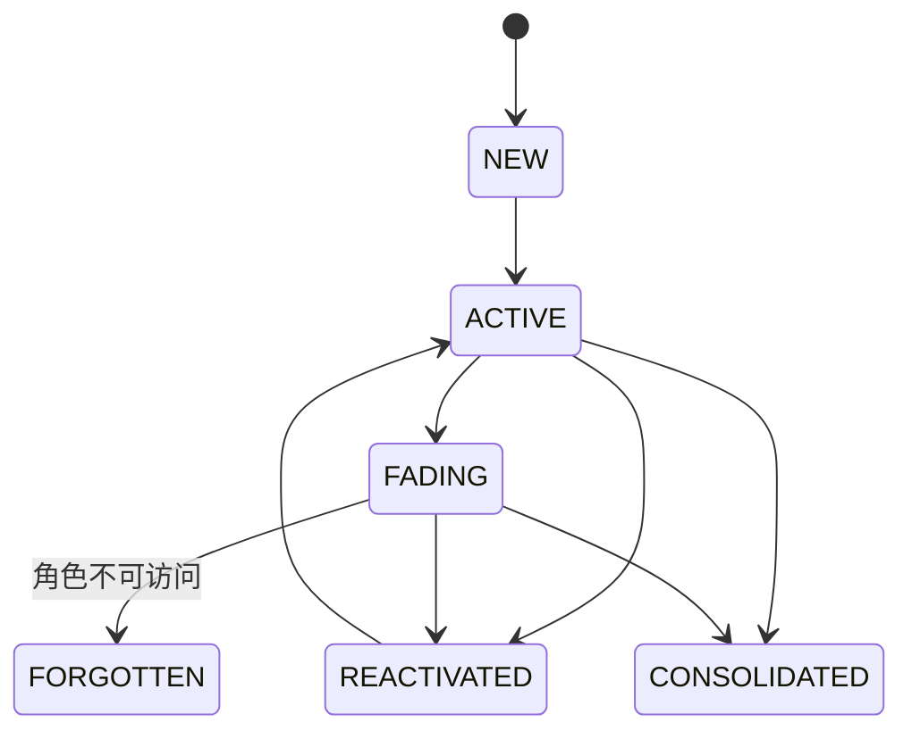

目标 habit：

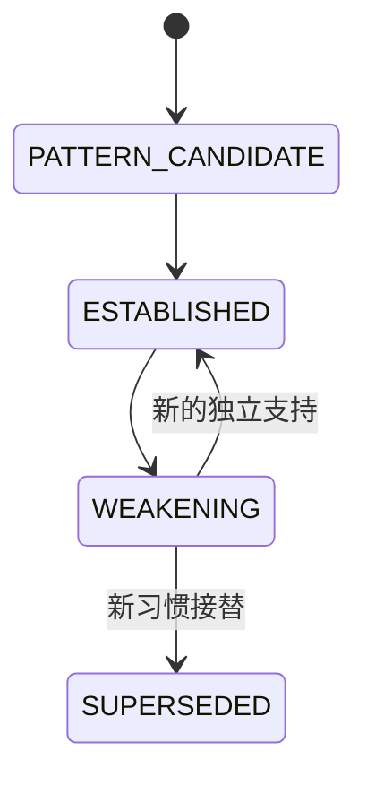

洗澡例子的**当前真实行为**：

- `她去洗澡了` + 分类 `状态` → `ephemeral`，**不写 long_memory**，TTL 2 小时。
- 连续 30 天凌晨四点洗澡：会留下最多约 30 条 ephemeral（按 `source_id` 去重；无 `source_event_id` 时用文本 hash）。**不会**形成 `用户通常凌晨四点左右洗澡`。
- 若提取器把同一件事写成“经历/其他”且没命中 ROUTINE_TERMS，会走 `default_durable_fact`，**直接进 long_memory**。这是当前最危险的分流漏洞。
- 失眠这类状态 topic 会进 `candidate`；独立来源 ≥3（有“最近/一直/每天”则 ≥2）会巩固成一句“她最近一段时间反复睡眠不好”，写入 `long_memory`。这是状态趋势巩固，**不是带时间窗的 habit**。

### 1.4 Habit Learning / Expectation（目标；当前 ❌）

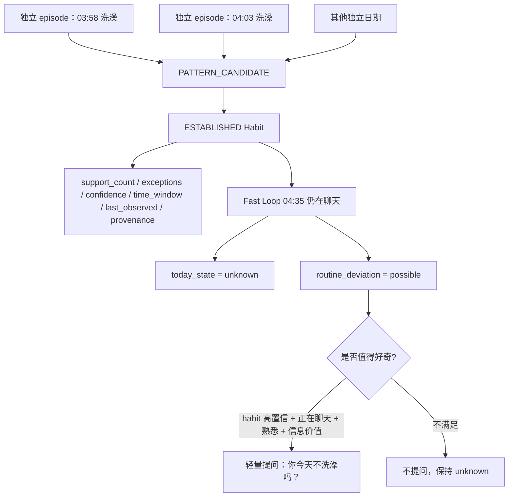

硬约束：

- 没有洗澡 event，只能得到 **unknown + possible deviation**，不能得到“今天没洗澡”。
- 关系越熟，只降低**提问阈值**，不降低**事实成立标准**。
- 提问本身不增加 habit `support_count`。

### 1.5 Relationship Engine V4

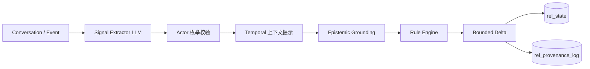

当前各段：

| 段 | 状态 | 实际逻辑 |
|---|---|---|
| Conversation/Event | ✅ | `process_turn` 在回复后异步跑 |
| Signal Extractor | ✅ | Observer LLM；prompt 禁止注入关系状态 |
| Actor Grounding | ◐ | 只校验 `user/character` 枚举，不核原文主语 |
| Temporal Grounding | ◐ | 把 temporal snapshot 当 prompt 上下文，不做逐 claim 有效期 |
| Epistemic Grounding | ❌ | 无独立模块；无“角色断言 ≠ 用户事实”的结构化闸门 |
| Rule Engine | ✅ | `_route_signal` + 阶段门控 + boundary/repair/flirt |
| Bounded Delta | ✅ | `apply_*` clip 到配置上下限 |
| Relationship Model | ✅ | `rel_state` 七维 + pending_passion + pending_hypothesis |
| Provenance | ◐ | 每次变化写日志，但是**另一条连接、另一次 commit** |

药酒 bug 的当前真实防护：

- Observer prompt 要求“只描述事件、不推断意味着什么”，**不能从代码证明**它不会抽出“用户正在服药”。
- 没有把“角色说别跟药一起喝”标成 `character_assertion`。
- 历史“通常晚上吃药”若已在 `long_memory`，召回时会变成“已确认事实”，主模型可能自行合成“今天药酒混喝”。
- 目标：当前喝酒 = 用户陈述；服药 = **OPEN QUESTION / HYPOTHESIS**；禁止 COMMIT FACT。

关系维度：

| 字段 | 含义 | 当前 |
|---|---|---|
| warmth | 靠近倾向 | `rel_state.warmth` |
| intimacy | 愿暴露真实自我的程度 | `rel_state.intimacy` |
| trust | 可靠性估计；正负不对称 | `rel_state.trust` |
| attachment | 牵挂 | `rel_state.attachment` |
| commitment | 持续投入 | `rel_state.commitment` |
| passion | 已获许可的热情 | `rel_state.passion` |
| pending_passion | 尚未过阶段/信任门的暧昧积累 | `rel_state.pending_passion` |
| friction | 分类账，不是总分 | JSONB |
| stage / nature | 派生标签 | `derive_label` |
| pending_hypothesis | 低置信关系候选 | `rel_state` JSONB，**不是** `cognitive_hypotheses` |

Passion 门：flirt 默认进 `pending_passion` / 解释类型（`relationship_flirt`），不是直接升爱情。爱情标签还要 trust / commitment 门槛。`relationship_initiative` 只改表达主动性，不写 `rel_state`。

### 1.6 Fast / Slow Cognitive Loop

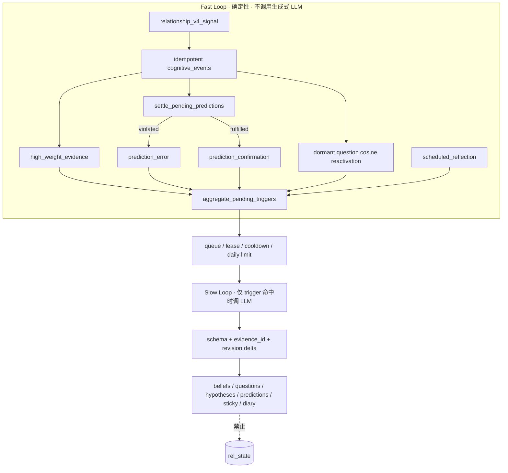

Fast Loop **已经在跑**，路径是：

`process_turn` → `ingest_v4_signals` → 记 event → 高权重 trigger → 预测结算 → question reactivation → commit → `aggregate_pending_triggers`。

服务启动时 `gojo_server` 调 `start_cognitive_worker()`。Scheduler 只写幂等 reflection event，不自己建 cycle。

Fast Loop 的精确范围：

- ✅ 不调用生成式 LLM 做真伪判断。
- ◐ `_embed_v4_evidence` 可调 embedding API；失败不阻断 ingress。
- ◐ 上游 Observer 是 LLM。所以只能说“给定 signals 后的规则决策是确定性的”。
- ❌ 当前 Fast Loop **不做** habit expectation、routine deviation、逐事实 expiry、统一时间状态更新。时间更新在聊天链的 `record_turn`。

Slow Loop 当前合法输出：

必填：`cycle_summary`、`question_updates`、`belief_updates`、`hypothesis_updates`、`new_predictions`、`evidence_refs`、`reflection_note`  
可选：`sticky_note_updates`、`diary_entries`

Slow Loop **不写** `rel_state` / relationship scores。这是代码铁律，且 worker prompt 写明。

### 1.7 Recall Architecture

**当前真实逻辑**

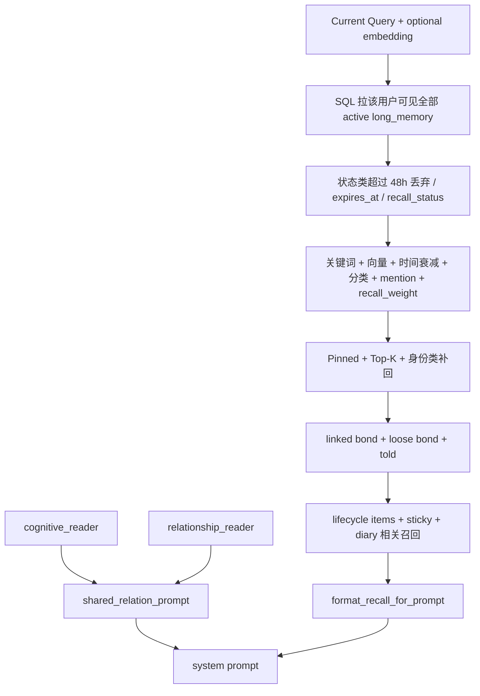

要点：

1. **不是** Eligibility-first。先全量读 `long_memory`，再 Python 打分。
2. long_memory 在 prompt 里的标题是：**“关于对方的已确认事实——这些都是真实发生过的，你必须当作确实知道”**。提取器并没有完整事实门，这个标题会放大错误。
3. 生命周期层已经单独标成“不等于永久事实”；sticky 标成备忘；diary 标成主观反思。标签不统一：长期层过硬，短层较准。
4. `cognitive_reader` 注入 beliefs / questions / hypotheses / sticky / reflection。**不注入 pending predictions**（刻意私有）。
5. 没有统一 token 总预算，只有各类条数上限。

**目标**

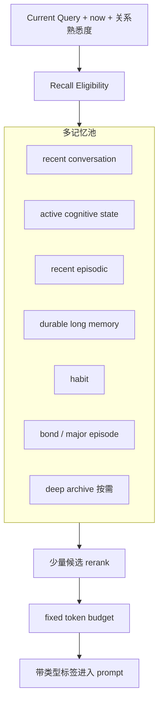

召回必须带类型：

- `CONFIRMED CURRENT`
- `HISTORICAL`
- `STABLE HABIT`
- `HYPOTHESIS`
- `OPEN QUESTION`
- `SUBJECTIVE INTERPRETATION`

原则：**Recall Eligibility before Similarity**。昨天服药可以 HISTORICAL，不能当今天已服药。

### 1.8 Storage Architecture

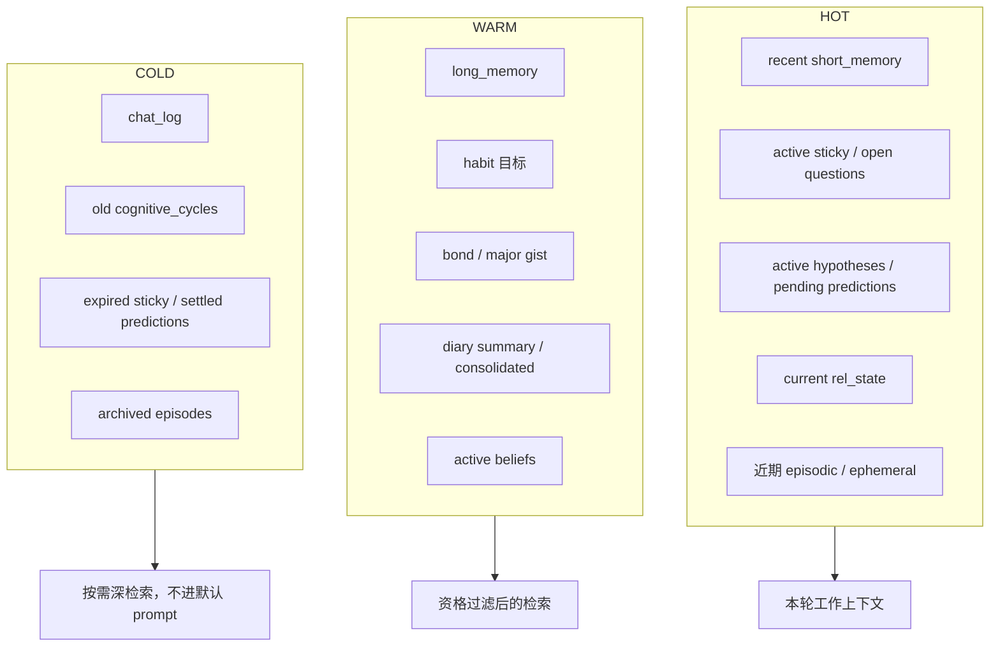

当前：HOT/WARM 有表；COLD 没有统一归档策略。`chat_log` 会一直长；删除气泡只去 `chat_log`（tombstone），不删记忆。`smart_recall` 对 WARM 的 `long_memory` 仍全量扫描。

原则：**Storage ≠ Accessible Memory ≠ Working Context**。五年百万条 chat 不应导致 RAM / prompt token / LLM cost 线性增长。

### 1.9 Embedding / Scalability

当前（`memory_search.py`）：

- 向量存在 `embedding_json TEXT`
- 进程内 `_CACHE` dict + `_MATRIX` numpy
- `CACHE_MAX` 默认 20000；冷启动加载最新 N 条
- `_cache_put` **没有对应淘汰**，长寿命进程可能超过上限
- `USE_RAG=0` 时整条向量路径关闭，召回退回关键词/时间
- cognitive questions 的 reactivation 同样是进程内余弦
- 明确注释：生产镜像没有 pgvector

小规模可用：单用户、数千到一两万条记忆，进程内检索足够。

长期目标：

```text
Python 全量 embedding cache
  → PostgreSQL + pgvector / ANN 按资格条件取 Top-K
  → Python rerank
```

不要给所有 raw chat 永久 embedding。优先：episode chunk、long memory、habit、bond、major episode、diary summary。

### 1.10 Anti-self-confirmation

错误环：

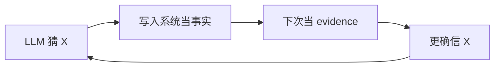

正确链：

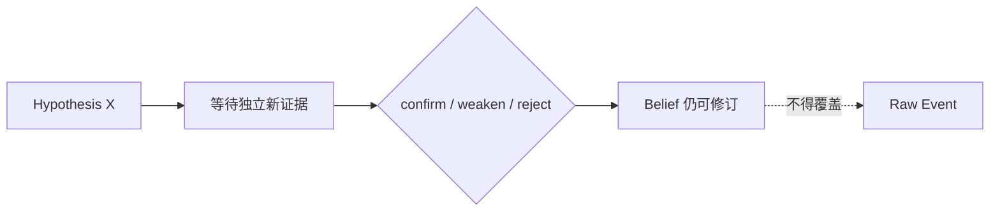

当前已有的阻断：

- Slow Loop 必须引用本 cycle 已声明的 `event_id`
- belief 不能把自己当新证据；confidence delta 由确定性表计算
- diary 召回规则写明“再召回不是新证据”
- `character_self_claim` 不进 bond，只进低置信 self-model evidence

当前仍开放的污染口：

- 记忆提取器 LLM → 直接 `long_memory` → prompt 称为“已确认事实”
- Observer LLM signals 成为 cognitive event payload；合法 `event_id` ≠ 原文支持该 claim
- lifecycle 巩固摘要可能被当成第二份独立事实
- mention_count / 向量命中次数不是独立行为次数

### 1.11 关键状态机（当前字段名）

Question：

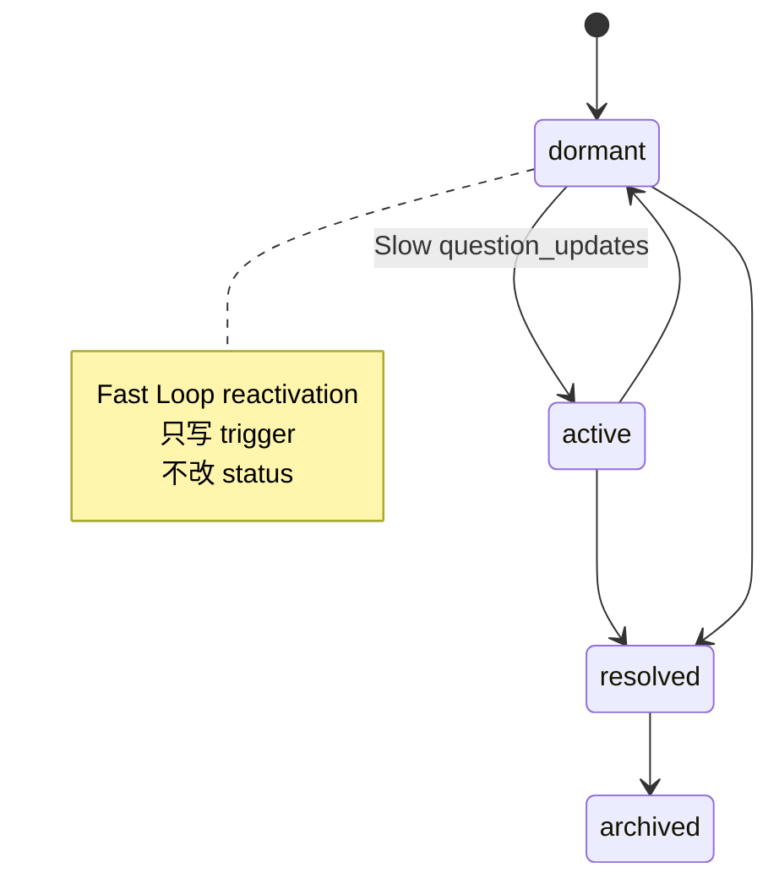

Hypothesis：

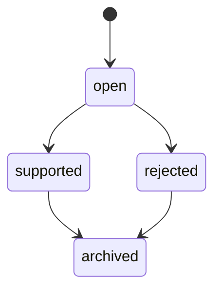

没有 `WEAKENED` / `COMMITTED_BELIEF` 状态。Belief 是独立表 `active/retracted`。晋升靠 Slow 输出 + `COGNITIVE_BELIEF_COMMIT_MIN_CONFIDENCE=0.78` + 至少 2 条独立 evidence。

Prediction：

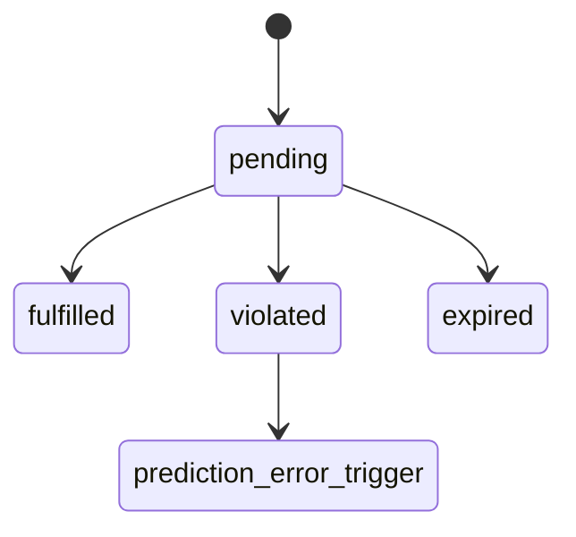

Sticky（当前表，不是目标四态）：

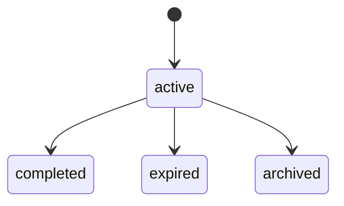

目标 Sticky：`ACTIVE → FADING → DORMANT → EXPIRED`，可 reactivation。当前没有 FADING / DORMANT。

---

## 2. Human-readable Mind Map

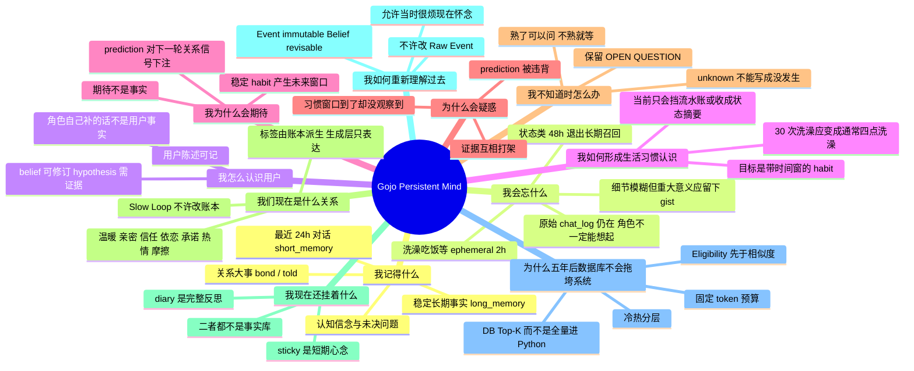

三句读懂：

1. **存储**是完整材料。  
2. **记忆**是经过选择、会衰减、可修订的认识。  
3. **工作上下文**是这一刻被允许送进模型的少量带类型内容。

越了解一个人，可以问得更贴切，**不能越猜越像事实**。

---

## 3. Current Implementation Matrix

| 能力 | 当前状态 | 文件 | 当前实际逻辑 | 与目标差距 |
|---|---|---|---|---|
| raw event / chat_log | ◐ | `db_chatlog.py` `route_chatlog.py` | 前端 `/chatlog/append` 同步；`client_msg_id` 去重；可单条删除 + tombstone | 可清空/删除，不是不可变证据库；`/chat/text` 不保证完整 raw 落库 |
| short memory | ◐ | `user_memory.py` `db.py` | 每对保留约 100 条；读取 24h 且最多 40；有 `source_event_id` 部分幂等；媒体摘要在 `event_meta` | 助手回复写入仍可能无 event id；不是永久来源凭证 |
| long_memory | ◐ | `user_memory.py` | LLM 提取 + `_valid_user_fact`（她开头、禁角色名）后可直写；lifecycle 可拦截部分日常 | 无 FACT/INTERPRETATION 类型；默认分类仍可能把日常写成长期事实 |
| bond / told | ◐ | `user_memory.py` `db_bond.py` | between / told 分桶；可 merge；self-claim 被拒绝进 bond | 无 major-episode gist 模型；无严格 provenance |
| memory_jobs | ✅ | `memory_jobs.py` `route_chat.py` | 聊天后入队，worker 串行跑 extractor；重启可续跑 | 与关系/认知不是同一事务 |
| memory_lifecycle | ◐ | `memory_lifecycle.py` | 无 LLM 关键词分流：ephemeral / candidate / episodic / sticky / 巩固摘要 | 不是海马体；巩固无时间窗；不是 habit |
| smart_recall | ◐ | `smart_recall.py` | 全量 long_memory 打分 + bond/told + lifecycle/sticky/diary | 无 Eligibility-first；长期层标题过硬；无总 token 预算 |
| memory_search | ◐ | `memory_search.py` | embedding JSON + `_CACHE`/`_MATRIX`；`CACHE_MAX=20000` | 无 pgvector；增量缓存无淘汰；RAG 默认关闭 |
| temporal awareness | ◐ | `temporal_awareness.py` | 快照、gap、prompt/提取/关系上下文；聊天链 `record_turn` | 不做逐事实有效期；不在 Fast Loop 内 |
| diary | ◐ | `diary_engine.py` `db_diary.py` `cognitive_diary_entries` | 事件日记 + 调度日记 + Slow diary_entries；召回有来源标签 | 两条日记链未统一经 Cognitive Gate |
| sticky note | ◐ | `cognitive_sticky_notes` `memory_lifecycle` `/grumbles` | Slow 可写 user-facing sticky；lifecycle 把临近考试写成内部 cue；`grumble_engine` 已退役 | 状态是 active/completed/expired/archived，另有独立 viewed / user_hidden_at；不要把 completed 当成已读 |
| candidate memory | ◐ | `memory_lifecycle_items.memory_kind=candidate` | 状态类 topic 等待巩固 | 无正式 Commit Gate 候选表 |
| episodic / hippocampal | ◐ | `memory_kind=episodic` | 显著事件词命中则 30 天情节候选 | 无 gist/衰减/重构；无独立日期流 |
| memory decay | ◐ | TTL + 48h 状态过滤 + 时间衰减评分 | 改变可访问性 | 无细节保真度衰减；过期不删 raw |
| consolidation | ◐ | `_maybe_consolidate_candidate` | 重复状态 → 一句趋势摘要进 long_memory | 不是 habit consolidation |
| habit learning | ❌ | 无表 | 无 | 需 schema + 独立 episode 计数 + 时间窗 |
| recollection / reconsolidation | ❌ | 无 | 无 | 允许回忆色彩变化，禁止回写 Raw |
| Memory Commit Gate | ◐ | lifecycle 分流 + `_valid_*` + Slow belief commit | 认知信念有证据门槛；用户事实没有四出口 Gate | 缺 COMMIT FACT / INTERPRETATION / DEFER / REJECT |
| fact / interpretation / hypothesis 分层 | ◐ | 认知层有；记忆层几乎无 | Slow 区分 belief/hypothesis；召回把 long 当事实 | 记忆提取未分层 |
| Relationship V4 主链 | ✅ | `relationship_engine.py` 等 | Observer → 规则 → bounded delta → rel_state；再 ingress 认知 | 严格 epistemic grounding 未做 |
| warmth/intimacy/trust/attachment/commitment | ✅ | `relationship_state.py` | 各 `apply_*` + clip | provenance 跨连接 |
| passion / pending_passion | ✅ | engine + flirt + config | 暧昧先 pending，阶段/信任门后才可能转正 | 目标语义基本对齐 |
| friction / stage | ✅ | JSONB + `derive_label` | 标签派生，生成层只表达 | 空账本有 unassessed 保护 |
| character assertion ≠ user fact | ◐ | Observer prompt + self-claim 分流 | 仅 prompt/部分规则 | 无结构化闸门，药酒合成仍可能发生在生成层 |
| cognitive_events | ✅ | `cognitive_events.py` | 复合唯一键幂等 | payload 主要是 V4 signals 不是逐字原文 |
| triggers / queue / worker | ✅ | `cognitive_triggers.py` `cognitive_queue.py` `cognitive_worker.py` | 高权重/预测/问题/self-claim/reflection → claim → Slow | 生活语义 trigger（habit deviation）没有 |
| predictions | ◐ | `cognitive_predictions.py` | 只结算下一事件是否命中 v4 signal selector | 不能表达“习惯窗口内是否洗澡” |
| questions | ◐ | `cognitive_output.py` `cognitive_reactivation.py` `cognitive_reader.py` | Slow 可生产/改 status；Fast 只写 trigger；reader 注入聊天 | 无“今天吃药了吗”这类变量级关闭条件 |
| hypotheses / beliefs | ◐ | `cognitive_output.py` `cognitive_revision.py` | 受控写入、scope、confidence delta、under_review | 无 weakened 态；记忆层事实仍可绕过 |
| cognitive reader | ✅ | `cognitive_reader.py` `shared_relation_prompt.py` | 聊天已读 summary/beliefs/questions/hypotheses/sticky | 预测不注入；生产回复效果 ? |
| Fast Loop no LLM | ◐ | `cognitive_events.py` | 无生成式推理；可调 embedding | 向量生成应移出纯确定性核心 |
| Slow Loop 不改 relationship | ✅ | worker + output | 无 `rel_state` 写路径 | 需保持；认知解释若要改关系必须重走 V4 |
| habit expectation / routine deviation | ❌ | 无 | 无 | 下一阶段优先 |
| pgvector / ANN | ❌ | 注释明确无扩展 | 进程内缓存 | 规模上来后再迁 |
| 生产是否在跑 | ? | 部署/日志 | 源码启动 worker；你此前确认跑过 | 本次未连生产库 |

---

## 4. Gap Analysis

### 4.1 当前最危险的问题

1. **召回把未过完整 Gate 的 `long_memory` 写成“已确认事实”。**  
   提取器是 LLM；lifecycle 只挡住部分关键词日常。漏网或错误分类的内容，会以必须相信的口吻进入主模型。

2. **没有 Epistemic Grounding。**  
   “所以就喝酒啦” + “别跟药一起喝” 在系统里仍可能被生成层合成“用户今天药酒混喝”。历史“通常晚上吃药”在召回里是事实语气，不是“习惯 + 今日未知”。

3. **没有 Habit，只有 ephemeral 或误入长期事实。**  
   三十次洗澡不会变成“通常四点洗澡”。要么过期消失，要么被写成多条/一条假稳定事实。Fast Loop 因此也无法做 routine deviation。

4. **自我证明仍可能从记忆提取口进入。**  
   认知 Slow Loop 的防自证明显强于记忆提取链。Diary/sticky 已打标签，但 long_memory 没有同等防护。

5. **关系状态与 provenance、认知幂等不在同一事务。**  
   重复请求可能先改关系，再在认知层被去重。账本变化和日志也可能只成功一半。

### 4.2 已经很好、不该重写的部分

- Relationship V4：Observer 不看关系状态、规则引擎、bounded delta、pending_passion、friction 分类账、declared stance、reader 只表达不判决。
- Cognitive Fast ingress：幂等 event、trigger、queue/lease、daily limit、Slow 在锁外调模型。
- Slow Loop 不写 `rel_state`。
- Prediction 收成单一语义 resolver，废弃消息数/时间代理。
- Belief revision 的确定性 confidence delta、scope 限制、under_review 展示。
- `character_self_claim` 不进 bond。
- `memory_jobs` 持久队列，避免 daemon 线程丢记忆。
- 聊天删除与海马体删除分离（tombstone 只打 chat_log）。
- 把日常洗澡挡出 long_memory 的方向是对的，应在此上演进，而不是推倒。

### 4.3 只需要改逻辑、不必先做大 schema

- `format_recall_for_prompt`：去掉“已确认事实/必须当作确实知道”；按 CURRENT / HISTORICAL / CANDIDATE 标注。
- Extractor 默认分类：禁止 `其他/经历` 把 routine 放进 long_memory；不确定就 DEFER。
- Observer 后增加确定性 actor 校验：角色说的药不能变成 user medication fact。
- Prompt 里“通常晚上吃药”必须带 STABLE HABIT 或 HISTORICAL，不得当今日观察。
- Sticky 与 Diary 在 prompt 中的职责再收紧（sticky ≠ 待办清单；lifecycle 把考试写成 sticky 已经偏任务化）。
- 关系 `apply_*` 与 provenance 改为同一连接同一事务。
- `ingest_v4_signals` 的幂等应发生在关系规则之前，或关系写入也吃同一 `source_event_id`。
- `_cache_put` 加上限淘汰。
- Fast Loop 把 embedding 调用移到 ingress 成功之后的非关键路径（已部分如此，需保证确定性核心不依赖它）。

### 4.4 需要 DB schema

- `habit_memory`：pattern_key、time_window、timezone、support_count、exception_count、confidence、last_observed_at、source_refs、status（candidate/established/weakening/superseded）、superseded_by。
- `memory_commit_decisions` 或等价：FACT / INTERPRETATION / DEFER / REJECT + evidence refs。
- episode 作为一等对象：occurred_at、valid_until、gist、salience、独立日期身份（不能用“又提起”当新 support）。
- Sticky 若要坚持目标生命周期：FADING / DORMANT / reactivation，不要复活 `grumble_engine`。
- claim 级字段：actor、epistemic_type（observation / user_report / character_assertion / inference）、valid_from/valid_until。
- 可选：`memory_trace` / recollection_version（多年后细节衰减，不改 raw）。
- `short_memory` / `chat_log` / cognitive / relationship 的统一 `source_event_id` 覆盖助手回复与外部事件。

### 4.5 属于未来 pgvector migration

- 用 SQL 资格条件 + ANN Top-K 替换 `SELECT 全部 long_memory`。
- 进程内 `_CACHE/_MATRIX` 只保留 rerank 的小候选集。
- 不为 raw chat 全量永久 embedding。
- question reactivation 从全表 Python 余弦改为候选检索。
- 在 eligibility 契约稳定之后再迁；**更快的向量检索不会修正错误的事实类别**。

### 4.6 下一阶段优先开发（建议顺序）

1. **Recall 标签与提取默认分流**（逻辑，立刻降低“把猜测当事实”的伤害）。  
2. **Epistemic / Actor Gate**：角色断言不得成为用户事实；药酒案例做成测试。  
3. **Memory Commit Gate 四出口**（最小 schema + 提取器改走候选）。  
4. **Habit：独立 episode → pattern → 时间窗**；Fast Loop 增加 expectation / unknown deviation。  
5. **Question 关闭条件**：`today.medication` 这种变量，被用户明确回答后 RESOLVED。  
6. **关系与认知同一 source_event_id 事务边界**。  
7. **固定 token 预算**。  
8. 数据量上来后再做 **pgvector**。  
9. Recollection / Self-model 细节衰减放到更后；现有 diary 已能承载部分主观重解，只要不回写 raw。

---

## 5. Architecture Laws

这些是目标约束。括号内是当前执行强度。

1. **Slow Loop 不直接修改 relationship_model。**  
   当前主表叫 `rel_state`。代码路径上 ✅ 已遵守。认知若要影响关系，必须作为新 evidence 再进 V4 规则引擎。

2. **Fast Loop 不调用 LLM。**  
   生成式推理 ✅ 没有。Embedding API ◐ 仍可能。Observer 在 Fast Loop 上游，不算 Fast Loop 内部。

3. **Cognitive Output 不绕过 evidence pipeline / rule engine。**  
   不直写关系账本 ✅。但记忆提取器仍可绕过认知门写入 long_memory ◐。

4. **所有持久写入必须有 provenance。**  
   关系变化有 `rel_provenance_log` ◐（跨事务）。认知写入有 cycle + evidence_refs ✅。long_memory 的 `source_event_refs` 刚加上，旧数据大量是空的 ◐。

5. **Inference ≠ Observation。**  
   认知层有 hypothesis/belief 区分 ◐。记忆层和召回层基本未执行。

6. **Character Assertion ≠ User Fact。**  
   self-claim 已隔离 ◐。对话中角色随口补全（药）没有结构化闸门 ❌。

7. **Raw Event 不能被 recollection / interpretation 覆盖。**  
   没有 recollection 写回 chat_log 的路径 ✅。但用户删除气泡会删 chat_log，这是产品删除政策，不是重构。目标应把“用户删除聊天”和“角色遗忘”分开——当前已朝这个方向做。

8. **Relationship Familiarity 只影响主动关注和表达，不改变事实成立标准。**  
   `relationship_initiative` 只改表达 ✅。系统里还没有“因为熟就降低证据阈值”的代码。 Habit curiosity 尚未实现，将来必须守这条。

---

## 6. 分层对象定义（统一语义）

| 对象 | 一句话 | 当前落点 |
|---|---|---|
| Raw Event | 发生过的不可改证据 | `chat_log` / 部分 `short_memory`；可变、非统一入口 |
| Fact | 有直接证据的用户世界陈述 | `long_memory` 被当成它，但资格不够 |
| Interpretation | 角色视角的理解 | diary / reflection / 部分 bond；未标类型 |
| Hypothesis | 可能如此，证据不足 | `cognitive_hypotheses` |
| Question | 我知道自己还不知道什么 | `cognitive_questions`；已能进聊天 |
| Prediction | 对未来可观察信号的明确预期 | `cognitive_predictions`；只覆盖 V4 signals |
| Habit | 多次独立观察形成的模式 | ❌ |
| Sticky | 此刻还挂在心里的短期主观工作记忆 | user-facing：`cognitive_sticky_notes` + `source=cognitive_slow_loop`。lifecycle sticky 是内部 cue。`char_grumble` 已退役为 legacy |
| Diary | 完整反思后的内心叙事 | `char_diary` + `cognitive_diary_entries` |
| Belief | 可修订的稳定认识，仍不是 observation | `cognitive_beliefs` + revision history |
| Episode | 有时间范围的一次事件 | lifecycle `episodic` 只是显著词命中 |

Prediction Error 目标链：

`Expectation → Reality → Mismatch → Question / Hypothesis → New Evidence → Belief Revision`

不要用 `missing += 10` 或直接加减关系分代替这条链。当前 prediction error 只升 trigger 优先级，不改关系分 ✅。

---

## 7. 验收场景（尚未被当前系统满足的，标 ❌）

| 场景 | 应当观察到 | 当前 |
|---|---|---|
| 同 source_event_id 重试 | 记忆/关系/认知无重复业务效果 | 认知 event ✅；关系写入 ❌；short 用户侧部分 ✅ |
| 角色说“别跟药一起喝” | 不产生用户正在服药的事实 | ❌ 无闸门 |
| 昨天讨论服药，今天喝酒 | 昨天 HISTORICAL；今天服药 unknown | ❌ 长期层无当天资格 |
| 30 个独立洗澡 episode | 一条带时间窗的 habit | ❌ ephemeral 或误入 long |
| 04:35 没看到洗澡 | unknown + 可能 curiosity | ❌ |
| 假设写进日记再召回 | 仍是解释，不是新 evidence | ◐ 标签有，生成层自律 |
| 旧习惯改点 | 旧模式 weakening，新模式 candidate | ❌ |
| 百万 raw | 固定预算 + DB Top-K | ❌ 仍全量扫描 long_memory |

此前测试（含 lifecycle / cognitive / revision）只证明其断言覆盖的代码行为，不等于上表场景已成立。本次未跑生产、未清库、未部署。

---

## 8. 源码锚点

| 主题 | 位置 |
|---|---|
| 聊天主链 | `route_chat.py`：short memory、prompt、提取入队、关系异步 |
| 提取与校验 | `user_memory.py`：`extract_and_save_memory` `_valid_user_fact` |
| 生命周期分流 | `memory_lifecycle.py`：`classify_memory_lifecycle` `apply_user_fact_lifecycle` |
| 召回 | `smart_recall.py`：`two_level_recall` `format_recall_for_prompt` |
| 向量缓存 | `memory_search.py`：`_CACHE` `_MATRIX` `CACHE_MAX` |
| 时间 | `temporal_awareness.py`：`get_temporal_snapshot` `record_turn` |
| 关系主链 | `relationship_engine.py` `relationship_signals.py` `relationship_state.py` `relationship_reader.py` `relationship_flirt.py` `relationship_initiative.py` |
| Fast Loop | `cognitive_events.ingest_v4_signals` |
| 预测 | `cognitive_predictions.py`：仅 `current_event_signal_outcome` |
| Slow 校验 | `cognitive_output.py` `cognitive_revision.py` `cognitive_worker.py` |
| 生成读取 | `cognitive_reader.py` → `shared_relation_prompt.py` |
| 启动 | `gojo_server.py`：init tables + `start_cognitive_worker` |

---

**结论：** 当前系统已经是多层记忆 + 多维关系账本 + 事件驱动认知循环，不是“把聊天记录塞进 prompt”。它缺的不是再堆一个 LLM，而是 **证据类型、时间资格、习惯层、以及召回时的诚实标签**。Fast/Slow 分工和“Slow 不改关系”值得保留。下一刀应砍在 **Memory Commit Gate + Habit/Expectation + Recall Eligibility**，而不是重写 V4 或 Cognitive Queue。
