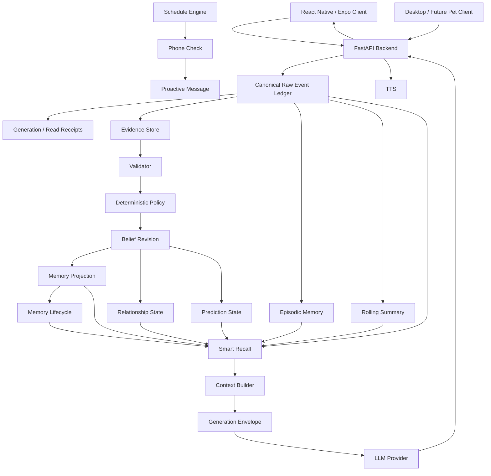

# Gojo Backend

> **面向长期角色一致性、可追溯记忆和持续认知的 AI Character Backend**

Gojo Backend 不只是一个聊天接口，而是一个围绕 **长期角色状态、记忆生命周期、证据驱动认知、关系演化、时间感知和主动行为** 构建的持续角色系统。

项目当前的核心目标是：

> **让角色的“记得、判断、关系变化和主动行为”不依赖单次 LLM 即兴发挥，而由可追溯、可撤回、可验证的程序状态长期维护。**

---

## 当前版本

**最近核对日期：2026-10-07**

```text
Repository : unreval/gojo_backend
Branch     : main
Main SHA   : a21e14e61ff629629ca6f26a2c131be96e0e98b2
Backend    : Python 3.11 + FastAPI
Database   : PostgreSQL
Deploy     : Zeabur
Client     : React Native / Expo
LLM        : Anthropic / DeepSeek compatible providers
TTS        : Fish Audio 等
Vector RAG : 当前默认关闭
```

### 当前总体状态

```text
Canonical Event / Provenance    ██████████  稳定化
长期记忆系统                     █████████░  稳定化
确定性认知系统                   ████████░░  已实现，继续验收
情感 / 关系系统                  ███████░░░  部分完成
Schedule / Phone Check          ███████░░░  已实现，存在 P0 状态机问题
主动消息系统                     ██████░░░░  部分完成
Slow Loop                       ██████░░░░  部分完成
Self Loop                       ████░░░░░░  尚未闭环
Prediction / Prediction Error   █████░░░░░  已有基础设施
Rolling Summary                 ██████░░░░  存在 Provider / 调度问题
Vector Retrieval / RAG          ██░░░░░░░░  暂缓
API Cost Governance             █████░░░░░  需要进一步收口
```

> 上述进度条表示工程成熟度，不代表代码覆盖率或论文式完成百分比。

---

# 1. 核心设计原则

Gojo 的认知系统遵守以下约束。

### 1.1 单一认知权威

不建立第二套“关系大脑”。

关系、记忆和长期判断必须来自同一套：

```text
Canonical Raw Event
        ↓
Evidence Store
        ↓
Validator
        ↓
Deterministic Policy
        ↓
Belief Revision
        ↓
Authoritative State
```

不能让：

```text
Prompt
LLM 回复
Rolling Summary
缓存文本
角色自己说过的话
```

直接变成新的长期事实。

---

### 1.2 LLM 不拥有事实权威

目标边界：

```text
程序：
形成判断
验证证据
维护状态
撤销错误
处理冲突
更新关系
控制记忆生命周期

LLM：
语言表达
非权威压缩
受约束的结构化辅助任务
```

最终生成回复：

```text
Authoritative State
        ↓
Context Builder
        ↓
LLM
        ↓
Natural Language
```

而不是：

```text
LLM
 ↓
猜一个关系状态
 ↓
写进数据库
```

---

### 1.3 所有 Durable Memory 必须具有来源

长期记忆（Durable Memory）不能成为孤立字符串。

目标形式：

```text
Memory
 ├─ semantic payload
 ├─ source event ids
 ├─ authority operation
 ├─ belief / judgment
 ├─ lifecycle state
 └─ provenance
```

如果源事件：

- 被删除；
- 被撤回；
- 被纠正；
- 被判定失效；

依赖这些证据形成的投影也必须能够重新验证或撤销。

---

### 1.4 Fast Loop 不调用 LLM

快速路径（Fast Loop）处理：

- 显式事实；
- 明确纠正；
- 用户直接回答；
- 已知 deterministic rules；
- source validation；
- revision；
- deduplication。

不应该为了判断一个确定性事件调用 LLM。

---

### 1.5 Slow Loop 不直接修改关系

慢速认知（Slow Loop）可以：

- 重新观察证据；
- 建立假设；
- 发现冲突；
- 形成 prediction；
- 提出待确认问题；
- 建立 candidate belief。

但不能绕过 Evidence / Policy 层直接把：

```text
relationship = intimate
```

写入最终关系状态。

---

# 2. 总体架构



---

# 3. Canonical Raw Event

Canonical Raw Event 是长期系统的事实基础。

系统不应该直接相信：

```text
memory table
summary
LLM interpretation
generated reply
```

而应该能够沿 provenance 回到：

```text
用户到底说了什么？
角色到底做了什么？
事件现在是否仍 active？
这个判断用了哪些 source？
```

### 当前状态

**已实现 / 稳定化中**

已经建立：

- Raw Event Ledger
- Source Validation
- Event ID
- provenance link
- active / deleted source 检查
- generation receipt
- read receipt
- history / replay 基础设施

当前最新主线进一步强化了：

```text
authority source
必须真正存在
且必须仍处于 active 状态
```

避免只有 source id 但实际原始事件不存在的问题。

---

# 4. 认知系统

## 4.1 Evidence Store

证据层负责保存：

```text
观察到了什么
来自哪个事件
属于什么类型
当前是否有效
```

Evidence 不等于最终结论。

---

## 4.2 Validator

Validator 判断：

```text
source 是否存在？
source 是否 active？
claim 是否与 evidence 对齐？
是否属于允许的 authority source？
是否发生 contradiction？
```

它负责阻断 hallucinated durable write。

---

## 4.3 Deterministic Policy

确定性策略（Deterministic Policy）负责：

```text
什么时候允许建立 belief
什么时候只能建立 candidate
什么时候必须等待确认
什么时候进行 revision
什么时候拒绝写入
```

目标是让关键状态转移可复现，而不是由 LLM 自由决定。

---

## 4.4 Belief Revision

当出现：

```text
纠正
撤回
反话
冲突证据
新的明确自述
source 删除
```

系统不会简单继续堆积旧判断。

而是进行：

```text
Evidence
   ↓
Conflict
   ↓
Revision
   ↓
New Judgment
```

从而允许角色真正“改正自己以前理解错的东西”。

---

# 5. 记忆架构

Gojo 当前不是单层 Memory。

```text
Canonical Event
      │
      ├── Recent Context
      │
      ├── Rolling Summary
      │
      ├── Episodic Memory
      │
      ├── Durable Memory
      │
      ├── Bond / Relationship Projection
      │
      └── Lifecycle Memory
```

---

## 5.1 Short / Recent Context

用于保持最近对话连续性。

特点：

- 高频；
- 短周期；
- 不等于长期事实；
- 可以随 context window 淘汰。

---

## 5.2 Rolling Summary

用于压缩长时间段对话。

它属于：

> **上下文压缩层，而不是事实权威层。**

当前存在生产问题：

```text
rolling_summary
    ↓
structured_output
    ↓
Provider
    ↓
PermissionDeniedError
```

并观察到失败后连续重试。

因此当前需要继续完成：

- quiet-period gate；
- no-new-event gate；
- Provider 403 fail-fast；
- cost gate；
- obsolete job cancellation。

---

## 5.3 Episodic Memory

保存具有时间范围的事件片段。

当前召回可组合：

```text
Recent Candidate
+
Lexical Candidate
+
Optional Semantic Candidate
```

然后进行统一 ranking。

当前生产配置：

```text
Vector Retrieval = Disabled
```

因此目前主要依靠：

- 最近事件；
- lexical retrieval；
- provenance validation；
- ranking。

---

## 5.4 Durable Memory

长期记忆不应只是：

```text
"用户喜欢 X"
```

当前目标已经转为第一人称语义：

```text
"她喜欢 X"
"她告诉过我 X"
"我接受她这样称呼我"
```

并使用 semantic payload 保存真正的机器语义。

### 当前状态

**核心机制已实现，旧数据迁移 / 分类审计仍需完成。**

重点包括：

- authority operation；
- semantic payload；
- provenance；
- subject reference；
- canonical dedup；
- source validation；
- first-person projection；
- told compatibility；
- legacy projection audit。

---

## 5.5 Memory Lifecycle

记忆具有生命周期：

```text
candidate
    ↓
consolidated
    ↓
decay / inactive / superseded
```

系统已经存在 lifecycle candidate 和 consolidated memory。

仍需进一步完成：

- 自然衰减参数正式定版；
- reinforcement；
- contradiction-driven decay；
- recall frequency feedback；
- 自动 consolidation 策略。

---

# 6. Smart Recall

Smart Recall 负责在有限 token budget 下选择真正需要注入的上下文。

主要来源：

```text
Recent Events
Lexical Episodes
Semantic Episodes（可选）
Durable Facts
Bond Memory
Told Memory
Lifecycle Memory
Rolling Summary
Relationship State
Cognitive Judgment
Sticky / Critical Context
```

典型流程：

```text
Candidate Generation
       ↓
Source Validation
       ↓
Ranking
       ↓
Budget Selection
       ↓
Prompt Context
```

### 当前状态

已具备：

- source validation；
- recent retrieval；
- lexical retrieval；
- episodic ranking；
- lifecycle retrieval；
- critical context protection；
- context budget。

Vector / RAG 暂时默认关闭，以控制成本和复杂度。

---

# 7. 情感与关系系统

目标不是一个：

```text
relationship_level = 7
```

这样的单变量。

而是多维长期状态，例如：

```text
trust
closeness
attachment
comfort
conflict
uncertainty
boundary
romantic tendency
interaction momentum
```

关系状态必须由 evidence 和 deterministic cognition 推导，而不能由回复模型自行修改。

---

## Canon Lock

Canon Lock 用于维持角色基础人格和关系边界。

目标不是永久锁死，而应该：

```text
Canonical Personality
        +
Accumulated Evidence
        +
Relationship Development
        ↓
Controlled Softening
```

当前仍需继续验证：

- Canon Lock 是否造成过度回避；
- softening 是否真实作用于生成链；
- 长期关系发展能否在不破坏角色设定的情况下改变表达。

---

# 8. Fast Loop / Slow Loop / Self Loop

## Fast Loop

目标：

```text
事件到达
 ↓
程序判断
 ↓
即时更新确定状态
```

特点：

- deterministic；
- no LLM authority；
- 低成本；
- 可重复；
- 可测试。

**当前：主体已实现。**

---

## Slow Loop

负责处理：

- 长期模式；
- 未决问题；
- 弱证据；
- prediction；
- contradiction；
- 延迟重新评估。

**当前：部分完成。**

仍需继续解决：

- structured output dependency；
- worker lifecycle；
- request budget；
- dead letter；
- trigger policy；
- candidate → authoritative transition。

---

## Self Loop

Self Loop 是未来真正持续认知的关键。

目标：

```text
Observation
    ↓
Prediction
    ↓
Future Evidence
    ↓
Prediction Error
    ↓
Belief Revision
    ↓
New Prediction
```

角色因此能够根据现实结果不断修正自己的世界模型。

**当前尚未形成完整闭环。**

---

# 9. Prediction / Prediction Error

项目已经建立 prediction 相关基础设施。

最终目标不是简单保存：

```text
我觉得她会做 X
```

而是保存：

```text
prediction
confidence
source evidence
expected horizon
actual outcome
prediction error
revision
```

从而形成长期学习机制。

---

# 10. Schedule / Phone Check / 主动消息

角色具有独立时间状态：

```text
Schedule
   ↓
Availability
   ↓
Phone Check
   ↓
Read / Seen
   ↓
Reply Decision
   ↓
Proactive Message
```

它允许角色即使 App 不在前台，也具有自己的时间行为。

---

## 当前 P0 问题

生产日志已经观察到：

```text
phone_check
    ↓
historical_occurrence
    ↓
reply
    ↓
rolling_summary
```

也就是说：

> 一个已经被识别为历史 occurrence 的旧 phone check，目前仍可能继续进入 reply。

这会产生两个问题：

1. 旧上下文可能突然补发过期回复；
2. 即使用户没有打开 App，也可能进一步触发 LLM 请求。

目标修复：

```text
historical / obsolete task
        ↓
settle / cancel
        ↓
NO GENERATION
        ↓
NO PROVIDER CALL
```

---

# 11. Online State

目标状态不是简单的：

```text
online = true / false
```

而是结合：

- 最近聊天；
- schedule；
- 当前 activity；
- phone availability；
- reply state；
- conversation continuity。

之前已有“聊天后自动调整在线状态”的机制，但仍需要和新 Schedule / Global State 架构重新统一验收。

---

# 12. Generation Envelope

生成层已经从自由文本逐步转向统一 Generation Envelope。

目标：

```text
Authoritative Context
       ↓
Generation Request
       ↓
Generation Envelope
       ↓
Protocol Validation
       ↓
Natural Reply
```

对于结构化响应：

- schema validation；
- protocol retry；
- fallback；
- diagnostics；
- provider error normalization。

但结构化输出不得成为长期认知权威。

---

# 13. Emoji 与 TTS

当前约定：

### 单 Emoji 是合法回复

例如：

```text
😒
```

必须能够独立作为完整角色表达。

不得因为“没有普通文字”被 validator 当作 generation failure。

---

### 非语言内容静音

例如：

```text
😒
……
...
```

不应强制送入 TTS。

---

### TTS

当前后端具备：

- TTS route；
- Fish Audio 接入；
- voice stream；
- non-verbal filtering。

客户端音频缓存和文件系统回归属于 `gojo_pub / gojo_simple` 侧继续维护的问题。

---

# 14. API / Provider / 成本控制

当前支持多 Provider abstraction，包括：

- Anthropic；
- DeepSeek compatible API；
- 其他 OpenAI-compatible route。

当前需要重点解决：

### Provider Permission

生产曾出现：

```text
PermissionDeniedError
```

尤其影响：

```text
rolling_summary
structured_output
```

虽然当前代码已经增加 Provider Error 分类和敏感响应清洗，但：

> 生产实际 worker 是否运行完全相同 build、以及所有异常路径是否都真正 fail-fast，仍需生产验收。

---

### API Cost Gate

目标是建立统一：

```text
Need Provider Call?
       ↓
Fresh Event?
       ↓
Still Relevant?
       ↓
Budget Available?
       ↓
Provider Healthy?
       ↓
CALL
```

以下情况原则上应该实现 **零 Provider 调用**：

- historical phone check；
- obsolete job；
- no-new-event rolling summary；
- duplicate task；
- deterministic fast path；
- Provider 已明确 401 / 403；
- no-op cognitive cycle。

---

# 15. RAG / Vector Retrieval

当前：

```text
USE_RAG != 1
Vector Retrieval = Disabled
```

这是有意设计，而不是缺失配置。

当前阶段优先：

1. 把 deterministic memory 做正确；
2. 把 provenance 做正确；
3. 把 lifecycle 做正确；
4. 把 cost gate 做正确。

之后再决定是否开启：

- embedding；
- vector database；
- semantic retrieval；
- external search。

避免为了“检索更智能”过早增加长期 API 成本。

---

# 16. 当前核心算法 / 机制

| 模块 | 主要机制 |
|---|---|
| Canonical Event | 事件溯源（Event Sourcing） |
| Evidence | 来源绑定（Provenance Binding） |
| Validation | Source Activity Validation |
| Cognition | 确定性状态转移（Deterministic State Transition） |
| Belief | 信念修正（Belief Revision） |
| Memory | Authority-gated Projection |
| Recall | Multi-source Candidate Ranking |
| Episodic | Recent + Lexical + Optional Semantic Retrieval |
| Lifecycle | Candidate / Consolidated / Decay |
| Relationship | Evidence-driven Multi-dimensional State |
| Slow Loop | Queue + Budget + Cooldown + Dead Letter |
| Prediction | Prediction / Outcome / Error |
| Schedule | Temporal State Machine |
| Phone Check | Claim / Seen / Reply State |
| Dedup | Idempotency / Watermark / Receipt |
| Generation | Generation Envelope + Protocol Validation |
| Structured Output | Schema Validation + Controlled Retry |
| Cost | Request Budget / Cache / Future Cost Gate |
| TTS | Non-verbal Filtering + Voice Provider |

---

# 17. 当前已完成的重要能力

### 已进入主线

- Canonical Raw Event / provenance 基础；
- generation receipt；
- read receipt；
- episodic retrieval；
- long-horizon recall；
- Smart Recall；
- memory lifecycle 基础；
- Evidence Store；
- deterministic cognitive processing；
- correction / revision；
- cognitive queue；
- request budget；
- dead letter / retry infrastructure；
- prediction infrastructure；
- Generation Envelope；
- structured output retry；
- emoji-only generation compatibility；
- non-verbal TTS silence；
- schedule engine；
- phone check；
- proactive infrastructure；
- 第一人称 memory projection；
- semantic payload；
- memory authority validation；
- legacy memory projection audit；
- Provider sensitive-response redaction。

---

# 18. 当前未完成 / 尚未闭环

### P0 — 稳定性

- historical phone check 必须禁止过期 reply；
- rolling summary no-new-event gate；
- rolling summary quiet-period gate；
- Provider 401 / 403 全链路 fail-fast 验收；
- 后台 worker API Cost Gate；
- 当前生产 build / worker 行为核验；
- 生产聊天完整验收。

### P1 — Memory

- legacy memory dry-run 分类审计；
- durable memory 旧数据迁移；
- natural decay 参数；
- lifecycle reinforcement；
- contradiction-driven invalidation。

### P1 — Cognition

- Slow Loop 完整生产闭环；
- Self Loop；
- Prediction Error 自动反馈；
- cognitive questions 生命周期；
- background cognition 成本治理。

### P1 — Relationship

- 情感状态多维统一；
- Canon Lock softening；
- Fast / Slow / Relationship 单一权威收口；
- relationship behavior regression。

### P2 — Retrieval

- Vector retrieval 重新评估；
- embedding cost model；
- optional RAG；
- 外部知识检索。

---

# 19. 当前已知问题

| 优先级 | 问题 | 当前状态 |
|---|---|---|
| 🔴 P0 | `historical_occurrence` 后仍可能 `reply` | 待修复 |
| 🔴 P0 | App 未打开时后台 worker 仍可进一步触发 Provider | 待成本闸门 |
| 🔴 P0 | `rolling_summary` 出现 `PermissionDeniedError` | 待生产核验 |
| 🔴 P0 | 403 路径生产日志曾连续 retry | 代码与生产行为需对齐 |
| 🔴 P0 | Rolling Summary 缺少可靠 no-new-event / quiet gate | 待修复 |
| 🟠 P1 | 旧记忆分类审计尚未完成 | 待 dry-run |
| 🟠 P1 | Slow Loop 尚未形成最终闭环 | 进行中 |
| 🟠 P1 | Self Loop 未完成 | 未完成 |
| 🟠 P1 | Canon Lock / Relationship softening 需重新验收 | 待验证 |
| 🟠 P1 | 在线状态与新 schedule 架构需统一 | 待整合 |
| 🟡 P2 | Vector retrieval 默认关闭 | 有意暂缓 |
| 🟡 P2 | 引用 / 时间相关修复分支需要重新核对与当前 main 的整合状态 | 待处理 |

---

# 20. 测试原则

项目测试重点不是：

> “LLM 今天恰好答对了没有？”

而是：

> “同一个 evidence 输入，系统能否产生可重复的 authoritative state？”

核心测试方向：

```text
Canonical Source
Evidence Validation
Memory Authority
Cognitive Determinism
Belief Revision
Source Withdrawal
Relationship Authority
Schedule State
Phone Check
Generation Protocol
Provider Failure
TTS / Non-verbal
Memory Lifecycle
Recall Ranking
```

当前主线包含大量专项离线回归测试。

生产验收和离线测试必须分开记录：

```text
代码存在
≠
专项测试通过
≠
完整回归通过
≠
已经部署
≠
生产真正验收通过
```

---

# 21. 开发文档

仓库目前包含以下核心设计资料：

- [`GOJO_PERSISTENT_MIND_ARCHITECTURE.md`](./GOJO_PERSISTENT_MIND_ARCHITECTURE.md)  
  持续心智与长期架构设计。

- [`COGNITIVE_DETERMINISTIC_V1.md`](./COGNITIVE_DETERMINISTIC_V1.md)  
  确定性认知系统。

- [`COGNITIVE_LOOP_V1.md`](./COGNITIVE_LOOP_V1.md)  
  Cognitive Loop 设计。

- [`COGNITIVE_CAPABILITY_GAPS.json`](./COGNITIVE_CAPABILITY_GAPS.json)  
  当前能力缺口。

- [`COGNITIVE_CONTRACT_COVERAGE.json`](./COGNITIVE_CONTRACT_COVERAGE.json)  
  认知契约与覆盖情况。

---

# 22. Backend 本地启动

## Python

建议 Python 3.11。

```bash
python -m venv .venv
```

Windows PowerShell：

```powershell
.\.venv\Scripts\Activate.ps1
```

安装依赖：

```bash
pip install -r requirements.txt
```

复制环境配置：

```powershell
Copy-Item .env.example .env
```

至少需要配置对应 Provider / TTS Key。

`.env.example` 当前提供：

```env
DEEPSEEK_KEY=
FISH_KEY=
FISH_VOICE_ID=

# 在 deterministic cognition 离线结果审核完成前谨慎启用
COGNITIVE_WORKER_ENABLED=false
```

生产数据库等配置以实际 Zeabur Environment Variables 为准。

启动：

```powershell
cd gojo_backend
python gojo_server.py
```

---

# 23. Docker / Zeabur

仓库 Dockerfile 使用：

```text
Python 3.11
↓
requirements.txt
↓
gojo_backend/
↓
python gojo_server.py
```

Docker：

```bash
docker build -t gojo-backend .
docker run --env-file .env -p 8080:8080 gojo-backend
```

生产当前使用 Zeabur 部署。

---

# 24. 仓库结构说明

```text
gojo_backend/
├─ gojo_backend/          # Python Backend 主体
├─ tests/                 # 离线 / 回归测试
├─ scripts/               # 开发、审计及辅助脚本
├─ app/                   # 历史 / 共存 Expo Client 内容
├─ components/
├─ assets/
│
├─ GOJO_PERSISTENT_MIND_ARCHITECTURE.md
├─ COGNITIVE_DETERMINISTIC_V1.md
├─ COGNITIVE_LOOP_V1.md
├─ COGNITIVE_CAPABILITY_GAPS.json
├─ COGNITIVE_CONTRACT_COVERAGE.json
│
├─ Dockerfile
├─ requirements.txt
└─ README.md
```

当前生产后端的核心代码位于：

```text
gojo_backend/
```

仓库中仍保留部分 Expo / React Native 文件，因此根目录并非纯 Python repository。

---

# 25. 下一阶段路线

```text
Phase A — Production Stabilization
│
├─ historical phone_check hard gate
├─ rolling summary gate
├─ Provider fail-fast
├─ Cost Gate
└─ production build verification
        ↓
Phase B — Memory Completion
│
├─ legacy audit
├─ lifecycle
├─ decay
└─ authority regression
        ↓
Phase C — Cognitive Completion
│
├─ Slow Loop
├─ Self Loop
├─ Prediction Error
└─ Relationship integration
        ↓
Phase D — Retrieval Expansion
│
├─ Vector evaluation
├─ RAG
└─ external search
```

---

# 26. 长期目标

最终 Gojo 希望实现的不是：

> 一个“记得很多聊天记录”的聊天机器人。

而是一个具有：

```text
持续事件历史
长期世界模型
来源可追溯记忆
可撤回信念
关系连续性
预测与预测误差
独立时间状态
主动行为
角色身份稳定性
```

的 Persistent Character Agent。

核心原则始终保持：

> **Evidence first.  
> State is authoritative.  
> LLM is expression, not truth.**

---

## Project Status

**Research / Active Development**

当前系统已经进入：

> **核心架构已建立 → 生产稳定化 → Slow/Self Loop 闭环**

阶段。

在 P0 调度、Provider 和 API Cost 问题完全验收以前，不将项目标记为 Production Stable。